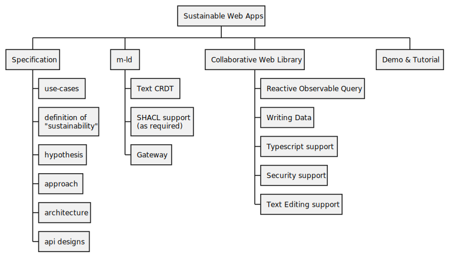

# project approach

Having made our [hypothesis](hypothesis.md), we need to proceed with a tractable project that confirms or refutes it. Fundamentally, our proof will be in the ability to code a live web application, from scratch in a 1-hour demo, using only readily-available tools and the supporting tools and libraries we develop in this project. (Naturally, there can be nothing specific to the use-case demonstrated in those tools.)

With this definition of done, we force ourselves to provide an **exceptionally smooth developer experience**. We will endeavour to make sure that the experience generalises to not just other demos, but also production applications!

Here's how we see everything breaking down. Note that the implementation artefacts are dependent on the specification and may change. Head to the [architecture](architecture.md) to read more about the justification for the abstract components mentioned.

## Specification

That's this repository!

It provides a draft specification for the library code we deliver, including defining a "sustainable app"; requirements with motivating use-cases; the technical approach taken, including justification of the project hypothesis; and abstract interface descriptions for application developers and framework developers.

Note that to avoid getting too obtuse, we will not create a "specification specification" here; instead we will create a draft Sustainable Web Apps specification and iterate and improve it over the course of the project.

## m-ld

As you can read in the [architecture](architecture.md), we want to layer our implementation code, with web-specific library support over a generic semantic web CRDT. That comes from the [**m-ld**](https://m-ld.org/) project. We're going to contribute to **m-ld** with the necessary support for Sustainable Web Apps, as appropriate for its level of abstraction and its own needs.

### Text CRDT

All our analysed [use-cases](../use-cases.md) involve editable text, and since we want to support live collaboration, that text generally needs to be editable by multiple users at the same time. We're going to build support for an [embedded text CRDT in **m-ld**](https://github.com/m-ld/m-ld-spec/issues/35). More generally, we will allow an application using **m-ld** to choose an appropriate data type for any given value in the Linked Data graph, such as binary when storing image data.

### SHACL support

In-line with our desire for an exceptionally smooth developer experience, we want to offer support for [strong typing](#typescript-support). When edits are concurrent during live collaboration, there needs to be [runtime support for type enforcement](https://github.com/m-ld/m-ld-js/issues/124).

### Gateway

We will provide and run an open-source cloud service that fulfils the requirements identified in the [architecture](architecture.md) for a server-based data store and message relay. This will help eliminate getting-started overhead for trials, research, personal projects and startups. In our demonstration we will emphasise that the Gateway is used for convenience and data durability, but is optional, and could be self-hosted.

## Collaborative Web Library

We will develop a developer-friendly solution for developing highly-interactive local-first applications using broadly adopted Linked Data semantics. It will essentially comprise the support necessary to use **m-ld** conveniently in a local-first web application.

### Reactive Observable Query

We will implement an interface which exposes the results of a useful query over a Linked Data graph as an RxJS Observable, suitable for any reactive application to subscribe to.

### Writing Data

We will develop simple API patterns for multi-collaborator writing to the Linked Data graph from the applications.

### TypeScript Support

We will develop and demonstrate patterns for using design-time application data types in the collaborative web library. We will offer patterns and tools to make this suitably ergonomic for an application using the Observables and hooks described above.

### Security Support

We will develop examples and tests to show integration with identity providers, with preference given to standards-based authentication protocols such as those compliant with SASL. We will show how user identity can be bound to data operations, with cryptographic strength.

### Text Editing Support

We will provide support in the Collaborative Web Library to easily use the new **m-ld** [Text CRDT](#text-crdt).

## Demo & Tutorial

In our closing demonstration, we will use the Collaborative Web Library and cloud Gateway to build a live web application, with the nature of a collaborative web page, having no additional server components, from scratch, using only readily-available tools.

We'll provide the demo also as an online tutorial for developers to try out and to remix, and to base their Sustainable apps on!
