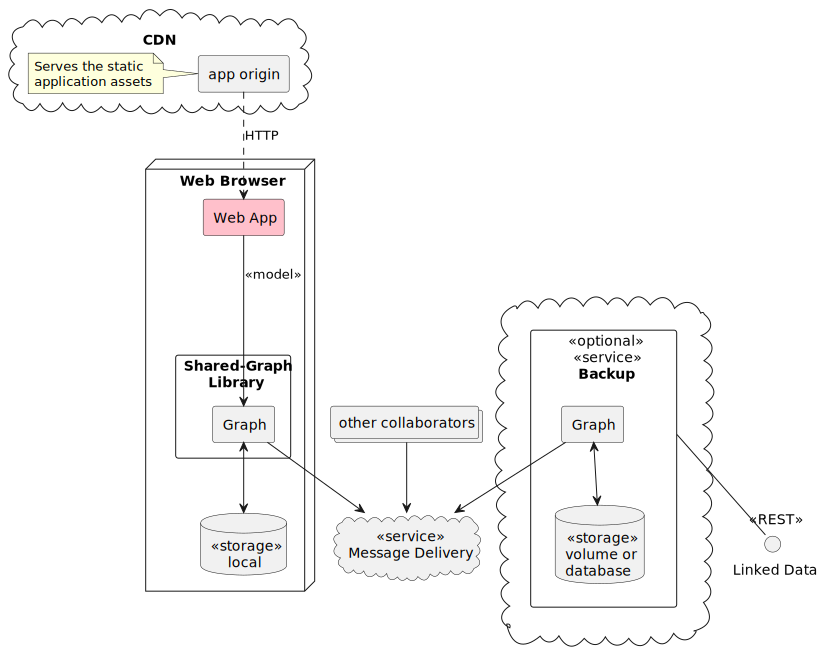

# architecture

## Components

Based on our [hypothesis](hypothesis.md), this is how we see a sustainable web app being structured, in the abstract.

- The JavaScript code and other static assets of the Sustainable Web App (the _app_, in pink) are served from some origin via HTTP.
- The app establishes a working Graph, comprised of _semantic web_ data (not being too specific yet as to serialisation).
- The Graph is stored locally, and so is available without a network round-trip (unless it has to be fetched to get started!). It is _local-first_.
- If other replicas of the Graph exist elsewhere, they are synchronised, when the network is available, via a Message Delivery service.
- If desired for data safety, the Graph can also be replicated to a Backup service, having its own persistent storage.
- Such a Backup service may also expose the data in the Graph as Linked Data via its own API. This makes the data de-referencable, via HTTP, for more loosely-coupled consumers.

### Collaborative Web Library

The Collaborative Web Library (the _lib_) is primarily responsible for ensuring that the Graph is as up-to-date as physics allows, compared to any other replicas that may exist. It exposes the Graph to the application via an [API, comprising Reactive Observable Queries and Data Writing](xql.md).

> In providing an easy-to-use and robust programming model, this API is the substrate on which Sustainable Web Apps might be built. It should ultimately find its place among the standards on which the Web is built. We may eventually recommend that it be supported natively by browsers.

### Services

While local-first in principle, Sustainable Web Applications can still benefit from secure durable storage of data on a server. They also rely on a message delivery mechanism, which in practice must be either a deployed service (like a message broker) or a cloud service. While these are cheap to set up, they may become expensive in the long run due to operational costs, provider markup and service over-specification.

Both Message Delivery and Secure Backup are therefore key components for a Sustainable Web App, and should preferably be treated as _attached resources_, as recommended in Twelve-Factor Apps [1]. Further, they should be _generic_, that is, not specific to the app. This will encourage an ecosystem of providers, who can be chosen on the basis of merit and value; and swapped at will (no lock-in).

For secure backup, this design aligns closely with the concept of [Personal Data Stores](prior-art.md#personal-data-stores) (PDS), but notice that here, the primary function of the service is to provide data safety. It may _also_ provide its own API to serve as a vector for de-referencing the Graph, thus potentially serving as a PDS, or even contributing to the Linked (Open) Data Cloud [2].

# bibliography
 [1] https://12factor.net/backing-services
 [2] https://lod-cloud.net/

---

| ≪ prev: [project approach](approach.md) | next: [security](security.md) ≫ |
|-----------------------------------------|---------------------------------|