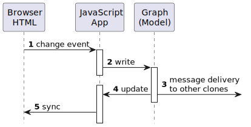
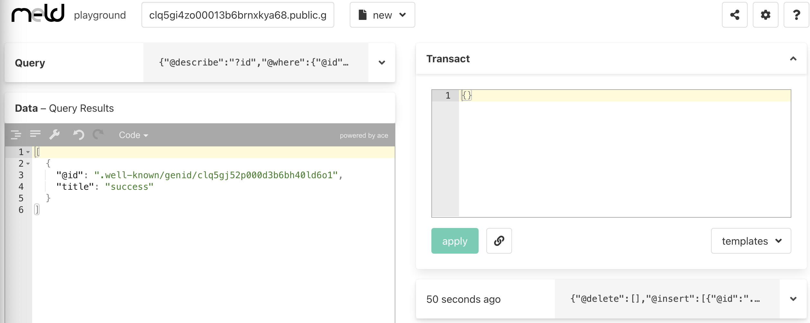

# Adding Todo List Items

Now that we have a model, we can enable the input box. After the call to `clone`, add these lines:

```js
const newInput = document.getElementById('new');
newInput.disabled = false;
```

Now, you should be able to type into the input box. We want the new Todo item to be added to our Todo list when the user presses \<Enter\>. We do that by adding an event listener for the `keyup` event, like this:

```js
newInput.addEventListener('keyup', (e) => {
  if (e.key === 'Enter' && newInput.value.length) {
    // <add the Todo>
    
    // Then clear the input box for the next item
    newInput.value = '';
  }
});
```

How do we add the Todo? At this point it's tempting to start constructing HTML for the list and its items, to go under our input box on the page. But, it's important that we drive the view from the model, not the other way around. This is always true in a well-structured user interface app; with a Shared-Graph Model it's even more important, because (in due course) it's always possible that updates will be appearing _from other users_ ("remote" users). The library we use for the model is designed to correctly apply remote updates, in such a way that everyone ends up with the same state – their local states "converge". Convergence is a surprisingly difficult property to guarantee – one of the reasons we are using a library in the first place.

So, the correct pattern is to make changes to the model; then have the changes be "echoed" back from the model. This ensures that the view (the HTML) doesn't get out-of-sync with the contents of the model, regardless of who made the changes and when. Writing to the model also gives the Shared-Graph Library the opportunity to deliver the change to other clones.



We'll get to steps 4 & 5 in a moment, but for now let's code up writing to the model (step 2). In **m-ld**, the API accepts [JSON data](https://spec.m-ld.org/#transactions). For now, all we have in a Todo item is its title, so writing to the model will look like this (to replace the "\<add the Todo\>" comment):

```js
    model.write({
      title: newInput.value,
    }).catch(console.error);
```

We haven't yet implemented any sync with the UI, but there is an easy way to see what's in our model, using **m-ld**'s _playground_. You may have seen that we are logging the domain name to the console as soon as the `clone` function returns. Put the domain name (e.g. "`clq5gi4zo00013b6brnxkya68.public.gw.m-ld.org`") into the box below, and click the link:

<a id="playground-link" href="https://edge.m-ld.org/playground/" target="_blank">https://edge.m-ld.org/playground/#domain=</a>
<input type="text" size="44" oninput="document.getElementById('playground-link').setAttribute('href', `https://edge.m-ld.org/playground/#domain=${this.value}`)"/>

Now, when you input a Todo in the app and hit \<Enter\>, you'll see data appearing in the playground:



Note that the data doesn't exist anywhere other than in your demo app, and now in the playground. By using the playground, you've created your first _clone_ of the data. It just happens that the playground is actually a completely different app. This is a key feature of using a Shared-Graph Model: that the sharing can be to other apps, live.


<a href="https://flems.io/#0=N4IgZglgNgpgziAXAbVAOwIYFsZJAOgAsAXLKEAGhAGMB7NYmBvAHgEIARAeQGEAVAJoAFAKIACEmQB8AHTQtJUMVAxoA5gF4ZIJttloZxBTAwATfYcMscxDGOqEMAJzgxiWkAFdiYALQAObTEAegtiKxs7TBwPADcIGAB3AAdaJ3CQe3pGBg9EiFNiQg1TGHjqGF98wsIKMQg0CGIIDChfOGpWmA0ARiDQuUsjZuJYKT4YLGSVRjFAIgIxPlpTWgBZADUeFmCRscGjYMITc32WACNlgE8wq1dqZvp7FTg4D2Jl2gxk5KCCjy+fiAbuEjEczDAnE8MC8PGDSk49PshlZCD0pCw7H9tIRaDg9O8VnBthh0Yc0UiQVYGslvBTkcRphgKjioPCPAB1RzEMRoGAwUxwMTvMRnGBiFa8gD82jplNs3loYFo1E8cFlQ2oz1e2l5iV8BNoMoMcqGWJAuqN9KGpggcAwZ1gpnVxAGxqG2zhEP0Yh9Ym2dweaDC2wupmucg9pCg+koIFcsHuEHoCEQIB6ABZEAAmHogAC+FHQ2FwqfwACsEFQ6AwmMQ8BApmlucBNfQYHVPJ4CnmxGAnLixAByEgMuCIYLBflqGDluD4LC+Vn4NJqScADxdDVKa-nFcHAG45A3UukxMBVpM0pcADJlGBQHt9gfD4ij8eT0zT2fzxemZdOVcYA3YIcCwK9FzvKBdzgA8j0bU9gAASVoAAlS9GDgR9+ywIcR2SMcJynGcKx-JcV3XF04GVABrNx8CTaDYIMNBqzgblq0gNQxA0M85B9QcAAECkHRAxE7AoAAoAEoKD4ocBJWLAMAaESxAAAwAEmAcTTGkvN8BpB0IGofA1ESUi-xXNTZLQH1p15OBbVE4gnE8ds5KTUTtKcCBRLUvCCOCMyLP-NQ1LzOQ80PFjk25MDSiUHiMESZT2KgNsJN1MQLzApwb0gupkLQsCMLqDiIDUKTotY2hYHwdK1AktTVmWe97CcExGFMMQMG5LTyrUZBBMU5S0EHABdPM1KqwYYrQNieSSRC0BpbkeJWFUcAYUy3BEWAtuIAAhS5EN0wddUHGa0F1ZbVvwG07QdfluN7VpXGim6Vu8fAzFMERYlra9bRyCEJMHWjLk8ZJBzqCSYCk7ipF42z6jAMQ4fwCHuI0HjBxEGsnEHMQADJicWxJbu+2JWjc+qmDUIoEeAOSfQnP1fqFI5Fg+b1fXi+98ESHzGAk5mUd9IUmlgUTPru6moDcmyJbzKT8E6YgHAkmq6ohfsnCq30WZCYJFiOWzNRMSEijFalvBFWg117NJObFXkN3qRgsCN2WqZpsVcaYn0IrQFXotjeMYETZM8CzABWRAAAZ83GqgoAaaiU1Qc1i3rNBtzVl5Y08JxyFTAL3ycZLTKaQhPDOVUIWrHJiDV3EQN-dvWX1D4sFiahfGpxooBUCtgg6sCAfad4OuCagXmCLcgILysQGIS5khLOM19gZO8yAA" target="_blank"> <b>New Todo handler, on Flems</b></a>